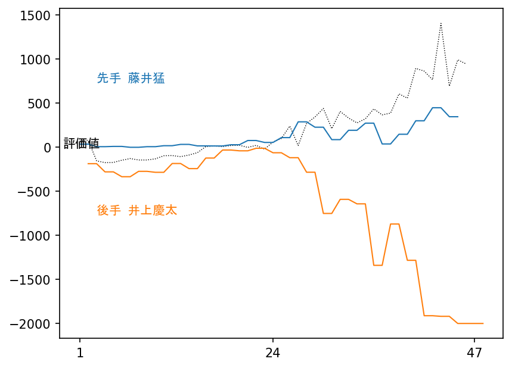

# notherScore

notherScoreは、評価値の新たな楽しみ方を提案する、Python上で動作する将棋用ツールです。

特定局面における従来の評価値は、厳密にはその局面で互いに最善の一手を重ねた先の局面における評価を示すものです。

現状のAIは、現在の技術の粋を極めたものではありますが、「人間では正解を指し続けられないような危うい手」を第一候補手とすることが少なくありません。もちろんAIはただただ強くなることを目指しているものなので、それが自然なことでもあります。

しかし他方で、人間同士の対局を鑑賞するためや、自分の棋力向上のためにAIの示す評価値をそのまま取り入れることは、誤った結論に導かれてしまいがちであることも確かです。

そこでこのツールは、特定局面における第一候補手と第二候補手の評価値における差を取ることで、評価値の別の楽しみ方を提案します。

もちろん、特定の一局面においてそうした計算を行うことは、既にGUI上で容易に行うことができます。このツールは自動化により、一局を通した流れにおける両対局者の「指し手の難しさ」をグラフ化することを試みています。

## 実例
以下は、1995年に行われた藤井猛六段-井上慶太六段戦（段位はいずれも当時）、有名な藤井システムの第一号局をnotherScoreで解析したものです（使用エンジンは水匠4、1手10万局面）。

このグラフを見ると、30手頃から井上六段のグラフが下方向に向かって大きく傾いているのが見て取れます。30手ごろと言えば、まさに桂馬が跳ねて角道を開ける、藤井システムが炸裂した瞬間とも言える場面ですが、評価値自体はやや藤井有利程度で、すぐに大きく開いているわけではありません。

しかしこの局面でグラフが下に振れているということは、井上六段は「一手間違えると大きく不利になる局面」に連続して立ち向かわなければならなかったということがわかります。結果として井上六段は徐々に不利に陥っていきます。

他方の藤井六段のグラフは中央から大きく離れることがなく、一見すると「何を指しても大勢に影響はない」ように見えますが、不安定な藤井システムの将棋においてそうした均衡を保つのにこそ超絶的な技量と研究が必要とされることは言うまでもありません。

## インストール
1. Pythonの環境において`pip install -r requirements.txt`（venvを推奨）
1. このREADMEのあるディレクトリへ、解凍した<a href="https://drive.google.com/file/d/1YwqmlQhfnRZDSrpISYNa4HvQaS9tEqvy/view?usp=sharing">水匠4</a>を「水匠4」ディレクトリごとコピー
1. config.iniを開きマシンに合わせたエンジンを指定する
1. このREADMEのあるディレクトリで`flask run`し、`http://localhost:5000/`をブラウザで開く

エンジンは水匠4でなくても、やねうら王互換（USI互換かつMultiPV対応？）のものであれば動くはずですが、確認していません。またエンジン次第ではMacやLinuxで動いても不思議ではないですが、もちろん確認していません。

動かなくても質問しないでください。答えられません。この項目の誤りや不親切さに対する、代替案込みの提案は歓迎します。
